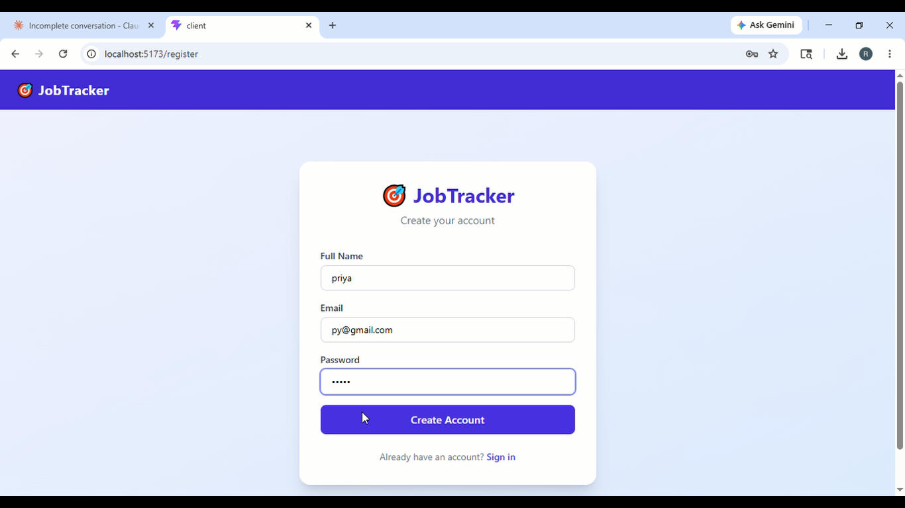
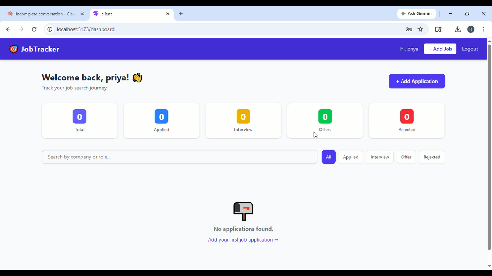
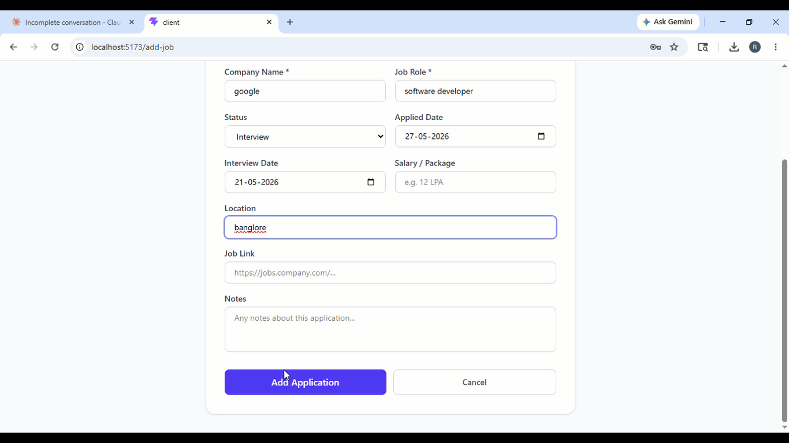
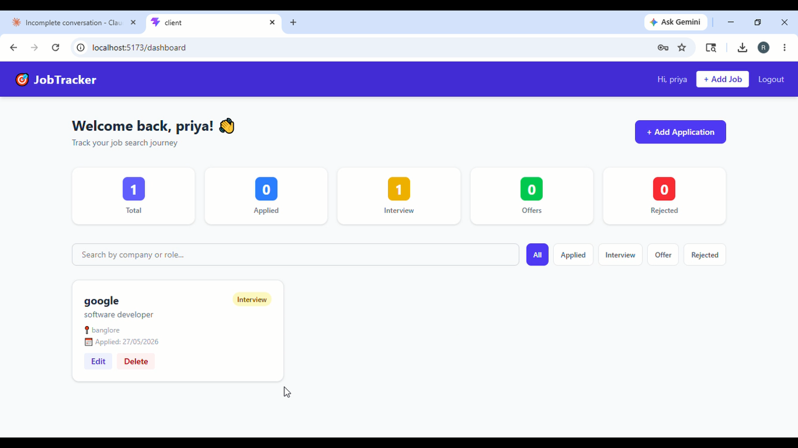

# 🎯 Job Application Tracker Portal

A full-stack MERN web application that helps job seekers track their job applications, interview stages, offers, and rejections — all in one clean dashboard.

[](https://github.com/YOUR_USERNAME/job-application-tracker-portal)

---

## 📸 Screenshots

| Dashboard | Add Application | Application List |
|---|---|---|
|  |  |  | |

---

## 🔥 Problem Statement

Job seekers apply to dozens of companies and lose track of:
- Which companies they applied to
- What stage each application is in
- When interviews are scheduled
- Which applications are still pending vs rejected

This portal solves that with a centralized, filterable, real-time dashboard.

---

## ✨ Features

- 🔐 Secure user authentication (JWT)
- ➕ Add job applications with company, role, status, dates, notes
- 📊 Dashboard with live stats (Total / Applied / Interview / Offer / Rejected)
- 🔍 Filter by status, search by company or role
- ✏️ Edit and delete applications
- 📱 Responsive UI built with Tailwind CSS
- 🔒 User data isolation (each user sees only their own applications)

---

## 🛠️ Tech Stack

| Layer | Technology |
|---|---|
| Frontend | React.js (Vite), Tailwind CSS, React Router v6 |
| Backend | Node.js, Express.js |
| Database | MongoDB Atlas, Mongoose ODM |
| Authentication | JWT, bcryptjs |
| HTTP Client | Axios |
| Dev Tools | Nodemon, dotenv |

---

## 🏗️ Architecture

Client (React) ←→ REST API (Express) ←→ MongoDB Atlas
↕
JWT Middleware

---

## 📁 Folder Structure
Job-Application-Tracker-Portal/
├── client/                 # React frontend
│   └── src/
│       ├── components/     # Reusable components
│       ├── pages/          # Page components
│       ├── context/        # Auth context
│       └── api/            # Axios configuration
├── server/                 # Node.js backend
│   ├── models/             # Mongoose schemas
│   ├── routes/             # API routes
│   ├── controllers/        # Business logic
│   ├── middleware/         # JWT verification
│   └── config/             # Database connection
└── README.md
---

## 🔌 API Endpoints

| Method | Endpoint | Description | Auth |
|---|---|---|---|
| POST | /api/auth/register | Register new user | No |
| POST | /api/auth/login | Login user | No |
| GET | /api/jobs | Get all user's jobs | Yes |
| POST | /api/jobs | Create job application | Yes |
| PUT | /api/jobs/:id | Update job application | Yes |
| DELETE | /api/jobs/:id | Delete job application | Yes |
| GET | /api/jobs/stats | Get dashboard stats | Yes |

---

## 🚀 How to Run Locally

### Prerequisites
- Node.js v18+
- MongoDB Atlas account

### 1. Clone the repository
```bash
git clone https://github.com/YOUR_USERNAME/job-application-tracker-portal.git
cd job-application-tracker-portal
```

### 2. Backend setup
```bash
cd server
npm install
cp .env.example .env
# Edit .env with your MongoDB URI and JWT secret
npm run dev
```

### 3. Frontend setup
```bash
cd client
npm install
# Create .env with: VITE_API_URL=http://localhost:5000
npm run dev
```

### 4. Open in browser
Visit: http://localhost:5173

---

🎥 Project Demo Video
📌 Watch Full Project Demo

Google Drive Video Link:

[https://drive.google.com/file/d/YOUR_FILE_ID/view?usp=sharing](https://drive.google.com/file/d/1Scx_5ZgrQy1-khExnHmwBhk0Bdy8GH0B/view?usp=drivesdk)

---

## 📚 Learning Outcomes

- ✅ Built and consumed REST APIs
- ✅ Implemented JWT authentication from scratch
- ✅ Designed MongoDB schemas with relationships
- ✅ Used React Context API for global state
- ✅ Applied protected routing in React
- ✅ Handled CORS, middleware, and error handling
- ✅ Followed MERN project structure conventions

---

## 👤 Author

**Rakshitha A S**  
B.E. Engineering Student

